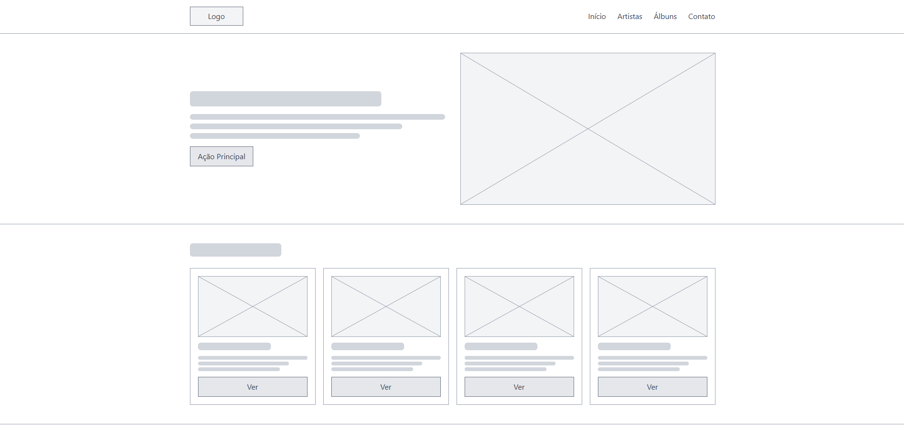
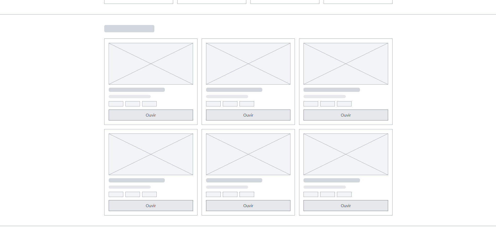
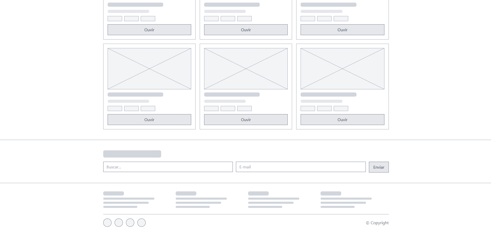
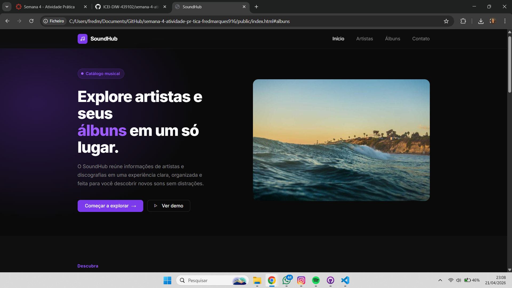
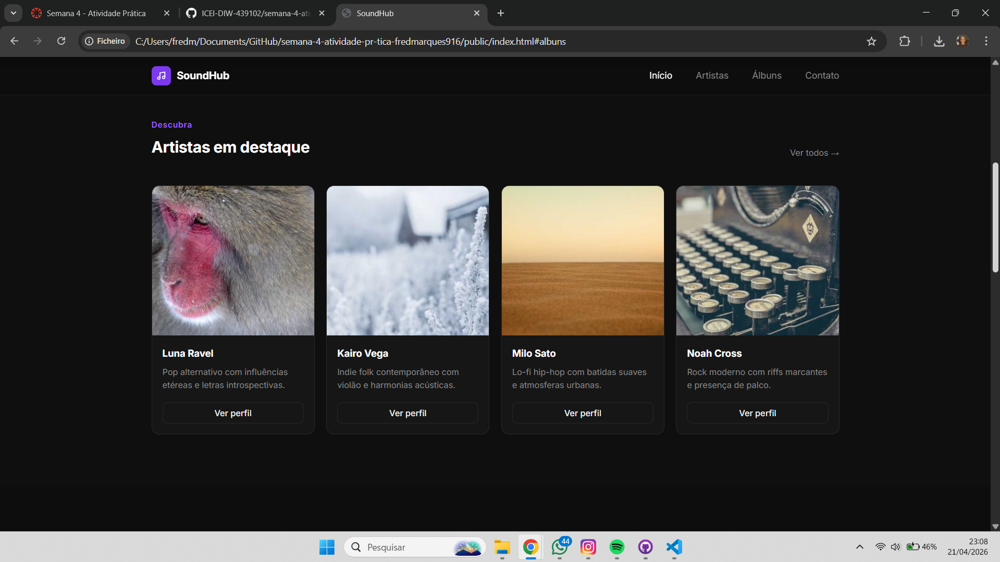
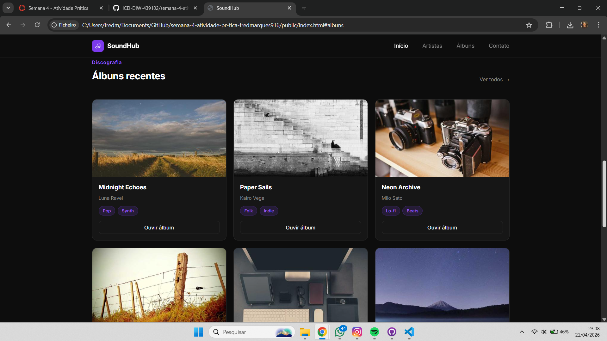
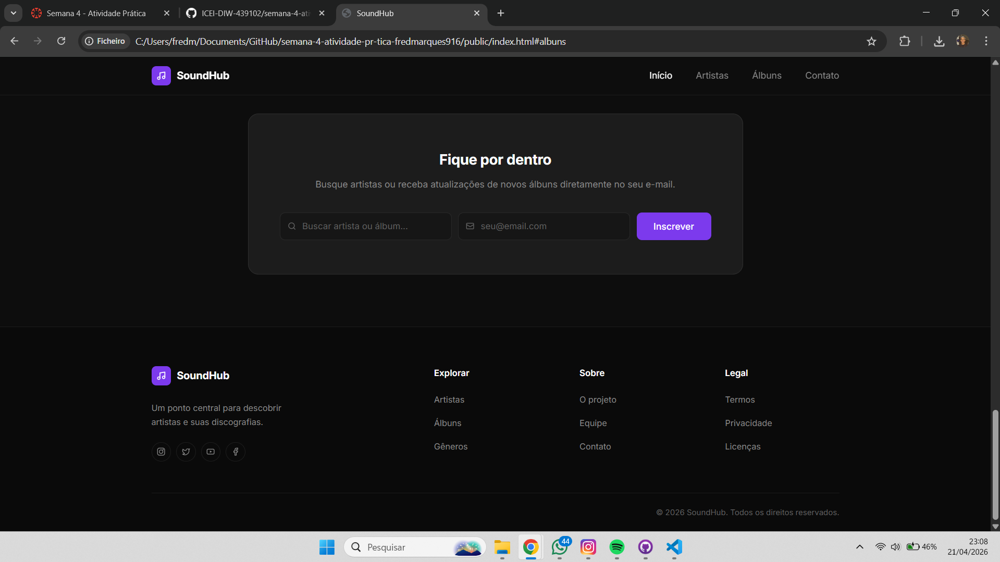

# Trabalho Prático - Semana 04

Dessa vez, vamos escolher uma proposta de projeto para trabalhar.

Nessa atividade, você deverá montar a página inicial do projeto escolhido, a organização do HTML aplicando semântica correta e uso aprimorado do CSS. Leia o enunciado completo no Canvas para mais detalhes.

**IMPORTANTE:** Você deve trabalhar e alterar apenas arquivos dentro da pasta **`public`**. Deixe todos os demais arquivos e pastas desse repositório inalterados. **PRESTE MUITA ATENÇÃO NISSO.**

## Informações Gerais

- Nome: Frederico Marcos de Paula Marques
- Matricula: 907680
- Proposta de projeto escolhida: Proposta 1 – Pessoas e Produções (Pessoa: Artista; Produções: Álbuns musicais)
- Breve descrição sobre seu projeto: O SoundHub é uma aplicação web que organiza e apresenta artistas musicais e seus respectivos álbuns em uma interface clara e intuitiva. A plataforma permite explorar informações sobre os artistas e suas produções de forma centralizada, facilitando a navegação e a descoberta de novos conteúdos musicais.

## Print do(s) wireframe(s) criado

## Print da home-page criada

